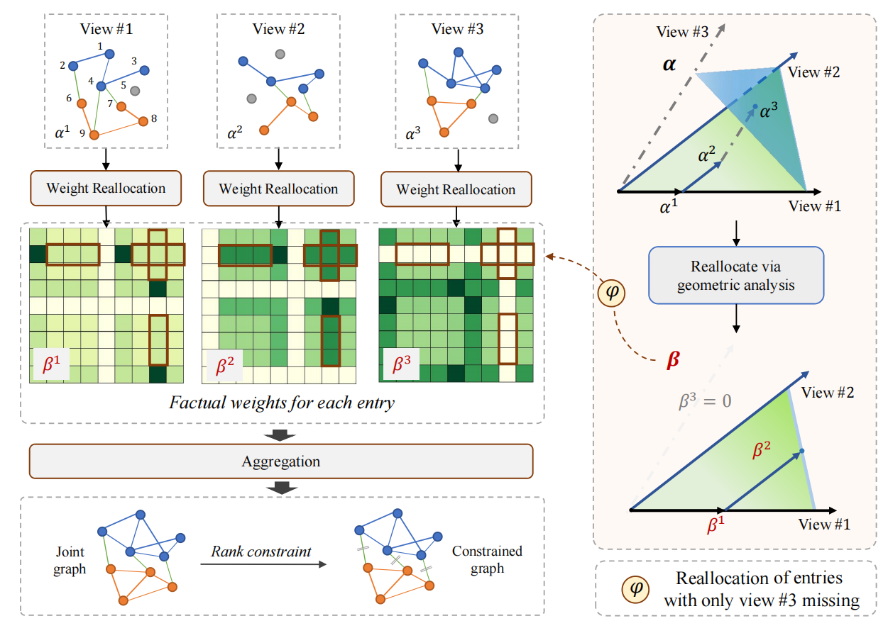
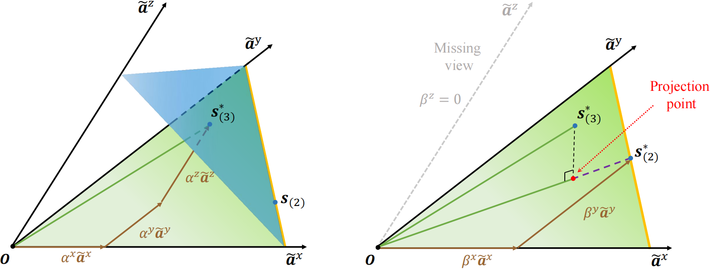

# Geometric-Inspired Graph-based Incomplete Multi-view Clustering
<!-- A python implement for Geometric-Inspired Graph-based Incomplete Multi-view Clustering -->

Here is the official python implementation of GIGA proposed in ''Geometric-Inspired Graph-based Incomplete Multi-view Clustering'', which is a flexible weight allocation strategy to solve the view missing problem in multi-view clustering.
**Title**: Geometric-Inspired Graph-based Incomplete Multi-view Clustering
**Authors**: Zequn Yang, Han Zhang, Yake Wei, Feiping Nie and Di Hu.
**Paper Resource**: [[Paper]](https://www.sciencedirect.com/science/article/abs/pii/S0031320323007793?dgcid=rss_sd_all)
## Apporach Overview
GIGA addresses the problem of incomplete multi-view clustering. It takes into account the impact of missing views on the weight aggregation strategy which integrates knowledge from different views. Moreover, a geometric-inspired reallocation approach is introduced to mitigate this influence and attain a superior aggregation solution.

 
 
 
 illustration of our proposed GIGA 
 

<!-- Our method can approach the full-view solution $\bm{s}^*_{(3)}$ using partial view, and obtain the optimal solution $\bm{s}^*_{(2)}$ which has the maximum cosine similarity with the full-view solution. -->

Using just available views, our method can approximate the full-view solution, denoted as $$s^*_{(3)}$$. We obtain the optimal solution $$s^*_{(2)}$$ on available views through projection, which has the highest cosine similarity to the full-view solution.

 
 
 
 Detailed illustration of our geometric analysis 
 

## Get Started
### Requirements 
<pre><code>
scikit-learn
qpsolver
munkres
</code></pre>
### Run
You can simply run the demo on MSRC-v1 dataset using:  
<pre><code>
python main_GIGA.py
</code></pre>
You can adjust the algorithm's detailed setting by modifying parameters such as the number of nearest neighbors. Alternate datasets can also be utilized, provided they adhere to the following preparation protocol.

### Data Preparation

Datasets are positioned within the ./data/ directory and stored as .npy files. When a dataset includes $l$ views denoted as $X^1, X^2, \ldots, X^l$, it should be formatted as a list $[X^1, X^2, \ldots, X^l]$. Each $X^v$ should be a matrix in the real number space $\mathbb{R}^{d_v \times n}$, where $d_v$ represents the dimensionality of the data in the $v$-th view. Appropriate datasets can be sourced from the following repository: [[link]](https://github.com/wangsiwei2010/awesome-multi-view-clustering#jump3).

## Citation

If you find this work useful, please consider citing it.

<pre><code>
@article{yang2023geometric,
  title={Geometric-Inspired Graph-based Incomplete Multi-view Clustering},
  author={Yang, Zequn and Zhang, Han and Wei, Yake and Wang, Zheng and Nie, Feiping and Hu, Di},
  journal={Pattern Recognition},
  pages={110082},
  year={2023},
  publisher={Elsevier}
}
</code></pre>

## Acknowledgement

This research was supported by Public Computing Cloud, Renmin University of China.
