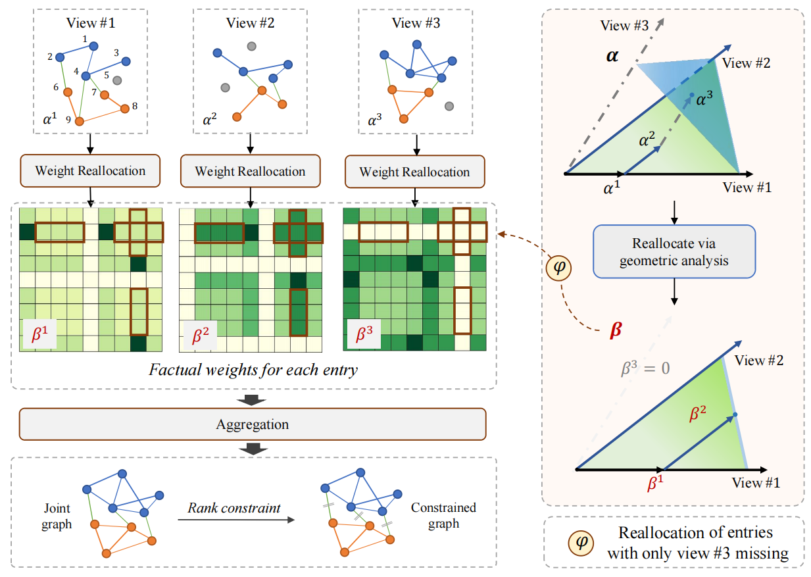

# Geometric-Inspired Graph-based Incomplete Multi-view Clustering
<!-- A python implement for Geometric-Inspired Graph-based Incomplete Multi-view Clustering -->

Here is the official PyTorch implementation of GIGA proposed in ''Geometric-Inspired-Graph-based-Incomplete-Multi-view-Clustering'', which is a flexible weight allocation strategy to solve the view missing problem in multi-view clustering.

## Apporach Overview
GIGA addresses the problem of incomplete multi-view clustering. It takes into account the impact of missing views on the weight aggregation strategy which integrate knowledge from different views. Moreover, a geometric-inspired reallocation approach is introduced to mitigate this influence and attain a superior aggregation solution.

 
 
 
 illustration of our proposed GIGA 
 

<!-- Our method can approach the full-view solution $\bm{s}^*_{(3)}$ using partila view, and obtain the optimal solution $\bm{s}^*_{(2)}$ which has the maximum cosine similarity with the full-view solution. -->
Our method can approximate the full-view solution, denoted as $\bm{s}^*_{(3)}$, using just available views. We obtain the optimal solution $\bm{s}^*_{(2)}$ on available views through projection, which has the highest cosine similarity to the full-view solution.
 
 
 
 Detailed illustration of our geometric analysis 
 

## Get Started

> pip install -r requirements.txt
> python main_GIGA.py